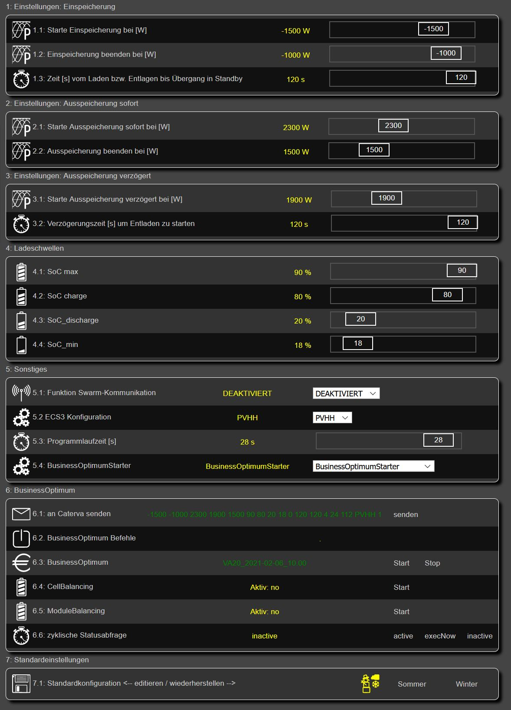
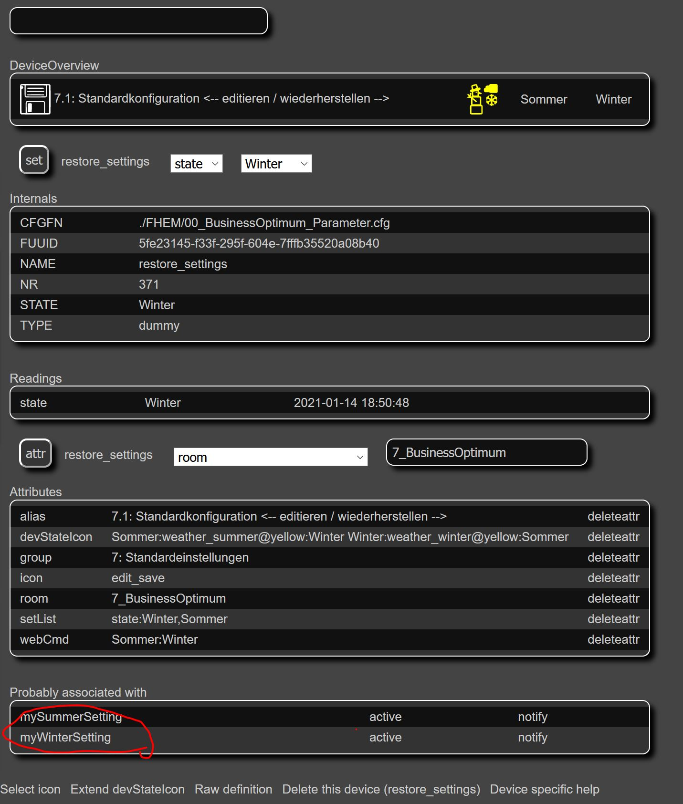
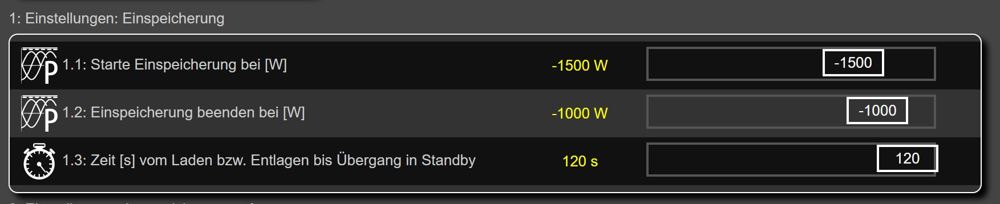
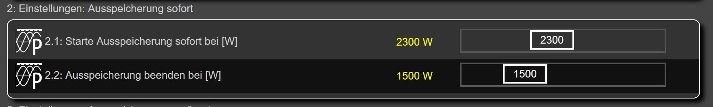
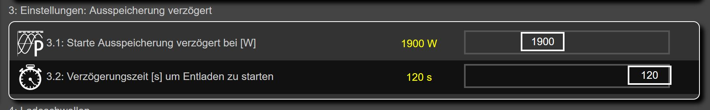
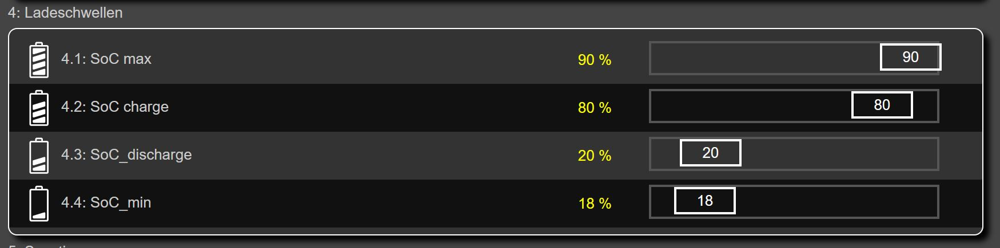
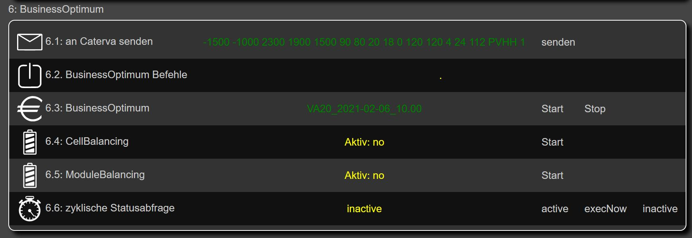
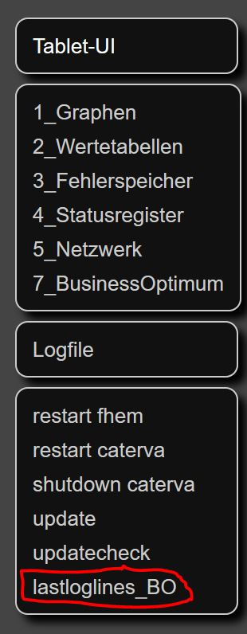

# Kurzanleitung FHEM 
 

**FHEM** steht für „**F**reundliche **H**ausautomation und **E**nergie-**M**essung“ und ist die neue Weboberfläche für den eigenverantwortlichen hausdienlichen Betrieb. siehe Kapitel II aus der Roadmap im Ordner Protokolle.

## Motivation

Seitdem wir keinen Zugriff mehr auf das Caterva-App haben, fehlt uns die Übersicht was das Gerät überhaupt macht, auch fehlt die  Zentralstelle in Pullach, die nach dem Speicher sieht. 

Technisch ist es dem Team zwischenzeitlich gelungen, einige Speicher wieder in Betrieb zu nehmen. Um die Speicher eigenverantwortlich hausdienlich in Betrieb zu nehmen ist eine graphische Oberfläche erfoderlich. Auch ist der Zugriff auf eventuell anstehende Fehler wünschenswert.
Genau diese Oberfläche ist in FHEM realisiert.

## Was ist FHEM

FHEM (TM) ist ein in Perl geschriebener, GPL lizensierter Server für die Heimautomatisierung. 
In FHEM können von den unterschiedlichsten Geräten im Haushalt Daten angezeigt und Steuerungsaufgaben programmiert werden.

## Funktionsumfang

Auf der Weboberfläche können die...  

... Leistungswerte ( Verbrauch / PV-Leistung / Leistung in bzw. aus dem Speicher / sowie der Netzbezug dargestellt werden.  
... Zählerstände ausgelesen werden  
... Weiterhin werden statistische Werte wie Tages/Monats/Jahresverbrauch berechnet  
... Fehlereinträge und Statusregister ausgelesen  
... Anzeige ob alle relevanten Netzwerkgeräte verfügbar sind  
... Anzeige Prozessorlast der Caterva   (Load)  
... Herunterfahren bzw Restart des Business-Controllers (Caterva) - Herunterfahren empfielt sich vor dem Ausschalten der Sicherung.
... Bedienoberfläche für Business-Optimum - damit können Vorgaben gemacht werden um den Wirkungsgrad der Anlage zu erhöhen. (Beta-Phase)

## Was brauche ich um FEHM zu benutzen?

FEHM ist auf den verteilten SD-Karten bereits installiert. Es genügt ein Internet-Browser um die Seite aufzurufen. 

## Wie kann ich FHEM öffnen?
|Bild|Beschreibung|
| :---:   |  :---     |
 | Wie gesagt genügt ein einfacher Webbrowser (Safari/Firefox/Edge/Chrome ...) <br><br>***Aufruf FHEM-Weboberfläche:***<br>```<IP-Raspberry>:8083``` <br>```Benutzername: pi```<br>```Passwort: pi```<br>Alternativ steht noch eine Ansicht zur Verfügung, die für Tablets optimiert ist.<br><br>***Aufruf Tablet-UI:***<br>```<IP-Raspberry>:8083/fhem/ftui/```<br>```Benutzername: pi```<br>```Passwort: pi```


  
 ## Wie wird FHEM aktualisiert?
 

|Bild|Beschreibung|
| :---:   |  :---     |
 | seit Jan. 2021 gib es die möglichkeit das Software selbst zu aktualisieren - hierzu muss aber eine Einstellung vorgenommen werden.<br>Folgendes muss einmalig in die FHEM Eingabezeile kopieren danach ENTER drücken: <br><br>```update add https://raw.githubusercontent.com/meschnigm/fhem/master/controls_webserver.txt```<br><br> Falls man eigne Konfigurationen in dem File  **00_Private.cfg** angelegt muss man dieses File zunächst vom Updatemechanismus ausschließen. Dies geht mit dem Befehl <br>```attr global exclude_from_update 00_Private.cfg``` <br> Im Anschluss <br>```update```<br>in die FHEM Eingabezeile eingeben und ENTER drücken. Sobald man dazu aufgefordert wurde noch ```shutdown restart```in die Eingabezeile sowie ENTER eingeben. <br>Nach dem Update findet sich im linken Menübaum neue Befehle:<br><br>***updatecheck***<br>Damit wird angezeigt welche Files bei einem Update installiert werden.<br><br>***update***<br>Damit wird künftig der Updateprozess gestartet - der Vorgang kann beim ersten Update einige Minuten dauern da vorher auch ein Backup erstellt wird. <br><br>***restart pi***<br>Nachdem der Prozess abgeschlossen ist muss ein Restart von FHEM durchgeführt werden.<br><br>
 
## Datenaktualisierung / Funktionsweise
Ein Skript aktualisiert minütlich die Daten auf den Raspberry.

## Wie kann ich FHEM starten und stoppen

FHEM startet automatisch mit dem Raspberry Pi. Normalerweise ist also nichts weiter zu tun.
Ein Neustart des Raspberry-Pi kann über den Befehl ```restart fhem``` im Menübaum ausgelöst werden

### alternativ über ein Terminal
Mit folgenden Terminal Kommandos kann man FHEM starten / stoppen / bzw. den Status abfragen <br>
`sudo systemctl start fhem`  
`sudo systemctl stop fhem`  
`sudo systemctl status fhem`  


## Screenshots Tablet-UI
|Bild|Beschreibung|
| :---:   |  :---     |
| | Links oben:  PV-Leistung und erzeugte Energie.<br>Rechts oben:  Leistungsverlauf Einspeicherung (gelb) und Ausspeicherung (grün) sowie Ladezustand in %.<br>Links unten:  Verlauf des Verbrauchs, dabei farblich dargestellt ob der Verbrauch über den PV-Direktverbrauch (gelb) das Stromnetz (rot) den Speicher (grün) bestritten wird. Zusätzlich wird auch die Energieaufnahme des Hauses in kWh dargestellt.<br>Rechts unten:  Verlauf der Leistungsaufnahme aus dem Netz (rot) sowie Netzeinspeisung (gelb).  
| | Identischer Inhalt wie Seite 1 - links unten. Zusätzlich werden einige statistische Daten wie Tagesverbrauch / Montasverbauch etc. angezeigt. (Diese Seite ist noch nicht vollständig implementiert.)
| | Diese Darstellung ist aus der Caterva-App bekannt. Zusätzlich ist hier noch Gesamtleistung der PV-Anlage sowie der Gesamtverbrauch dargestellt. Der linke Teil zeigt den Energiefluss des Tages - hierzu muss der Raspberry aber über Nacht durchgelaufen sein. 
| | Die Fehlereinträge des Stromspeichers werden alle 10 Minuten ausgelesen und angezeigt. 
| | Und hier auf einem Lenovo Smart Tab M10 mit dem Fully Kiosk Browser. Dieser Browser lässt sich im Fullscreen Mode betreiben und hat in der kostenpflichtigen Variante (6,95€) eine Bewegungserkennung und schaltet dann das Display an.

## Screenshots FHEM-WEB
|Bild|Beschreibung|
| :---:   |  :---     |
| |   Diese Seite zeigt identische Informationen wie Seite 1 des Tablet-Ui aber zusätzlich noch den Load Verlauf (Prozessorlast des Business Controllers) Hohe Systemauslastung führt bei einigen Anlagen zu Problemen. Eine hohe Systempast liegt bei werten zwischen 5-6 vor.
| | Darstellung der Momentanleistung sowie der Zählerstände. 
| | Alle 10 Minuten werden die Fehlerspeicher aktualisiert, in der FHEM Weboberfläche kann die Datenaktualisierung über einen Update-Knopf auch angestossen werden.
| | Auf diser Seite können einige Statusregister der Caterva ausgelesen werden. Einige Kommandos sind nicht bei allen Generationen vorhanden. Nur bei der GEN2 lassen sich hier z.b. die Spannungen der einzelnen Akkus anzeigen.<br> Im Abschnitt Systembefehle können wie in der Beschreibung gezeigt weitere Systembefehle abgesetzt werden die derzeit nicht implementiert sind. Falls einzelne Register noch von Interesse sind können diese implementiert werden. <br> Drückt man auf eine der Registernamen werden die Inhalte angezeigt. Über den Update Button wird das Register neu eingelesen. Sollten die Befehle aus diesem Abschnitt nicht klappen bitte den Abschnitt "Aktuelle Probleme" lesen.
| | Bei der GEN2 können über "Statusregistern" --> "Status Batteriemodule (Gen2 only)" die Modulspannungen angezeigt werden.
| | **Die Folgenden Seiten befinden sich aktuell im Beta-Status und sind ggf. noch nicht allgemein zugänglich.** <br>Über dieses Menü können die Parameter für die BusinessOptimum Logik erstellt und zur Caterva übertragen werden. Diese Logik soll den Speicherschrank daran hindern bei geringer Leistung aktiv zu werden, da hier der Wirkungsgrad relativ ungünstig ist. Es kann also erreicht werden, dass erst ab 2500W eingespeichert wird und nur bei einem Verbrauch von 3000W ausgespeichert wird. Jeder kann die Parameter auf seine Gegebenheiten anpassen. Die Werte in gelb entsprechen der aktuellen Einstellung - mit den Schiebereglern können die Werte verändert werden. Nur wenn gewisse Abhängikeiten eingehalten werden, ist die Kofiguration lauffähig. Fehlerhafte Einstellungen werden rot dargestellt und können nicht auf die Caterva gesendet werden. 
| |Im Menüpunkt "Standardeinstellungen" können durch anklicken auf Sommer bzw. Winter zwei Standardkonfigurationen eingespielt werden. Dies ist hilfreich falls die Parameter noch nicht initialiisert sind (???). Will man eigene Standardkonfigurationen abspeichern klickt man auf "Standardkonfiguration editieren".
| |Ganz unten in dem Dialog welcher sich daraufhin öffnet findet man "mySummerSetting" und "myWinterSetting" klickt man diese öffnen sich weitere Details.
| |Die eigentlichen Parameter lassen sich nach Klick auf DEF auch verändern. 
| |Im Menüpunkt "Einspeicherung" kann über zwei Regler der Einschaltpunkt und der Abschaltpunkt für das Einspeichern bestimmt werden. Wird die Schwelle für Einspeicherung beenden für eine Zeit unterschritten geht der Inverter in den Standby betrieb. Diese Zeit kann mit dem Parameter 1.3 eingestellt werden.
| |Im Menüpunkt "Ausspeicherung sofort" findet sich die Einstellung ab welcher Leistung eine Ausspeicherung ohne Zeitverzögerung beginnen soll. 
| |Im Menüpunkt "Ausspeicherung verzögert" findet sich die Einstellung ab welcher Leistung eine Ausspeicherung nach einer gewissen Verzögerung beginnen soll. Mit diesen beiden Parametern kann man gezielt auf einzelne Verbraucher reagieren.
| |Im Menüpunkt Ladeschwellen kann unter 4.1 der Maximale SoC eingestellt werden auf welchen der Speicher aufgeladen wird. Werte größer 90% lassen sich nicht einstellen da die Caterva interne Logik dies nicht zulässt. Ein erneutes Einspeichern wird erst gestartet wenn der Parameter 4.2 Soc-Charge unterschritten wird. Damit wird ein ständiges Nachladen verhindert. Der Parameter SoC-Discharge ist die Ladeschwelle auf die sich der Speicher entladen soll. Fällt der Speicher auf einen Ladezustand von SoC-min wird ein Notladeprogramm gestartet und der Speicher wird über das Versorgungsnetz auf SoC-Discharge aufgeladen.
| |die Zeile 6.1 zeigt die Konfiguration im Kurzform - wird diese Zeile grün angezeigt wird die Konfiguration von FHEM als lauffähig bewertet. Erst über den "senden" Button wird die Konfiguration zur Caterva übertragen.<br> die Zeile 6.2 zeigt in diesem Fall kurz die Rückmeldung "gesendet" darüberhinaus weitere Kommandos die gesendet werden können <br> die Zeile 6.3 zeigt die Version der Business Optimum Logik diese Information bitte bei eventuellen Auffälligkeiten immer angeben. Auch kann hier die Logik angehalten werten --> "stop" oder Anschluss neu gestartet werden. Dieser Startvorgang dauert einige Zeit da hier die Caterva neu gestartet wird. <br> die Zeilen 6.4 und 6.5 Zeigen an ob Modul bzw. Cell balancing aktiv sind. Diese Funktion ist nur bei GEN2 Anlagen gegeben. Diese Funktionen sollten nur verwendet werden wenn es einen konkreten Anlass dafür gibt. <br> in Zeile 6.6 gibt es dann schließlich noch eine Einstellung zur Statusabfrage. Damit werden die Daten im darüberliegenden Bereich aktualisiert. Mit "execnow" wird der Status einmalig aktualisiert mit der Einstellung "activ" erfolgt diese Aktualisierung zyklisch. Wer ressoucen sparen möchte stellt die Abfrage auf "inaktiv" und verwendet ausschließlich die "execnow" Variante.
| |"lastloglines_BO" steht für die letzen Zeilen im Logfile der Business Optimum Logigk. Dies ist extrem wichtig um die korrekte Funktionsweise zu prüfen. Speziell wenn eine neue Konfiguration erstellt und gesendet wurde kann man hier sehen ob diese auch übernommen wurde.<br> Tipp: will man eine größere Anzahl von Zeilen angezeigt bekommen kann man die letzte Zahl im der Browseradresse entsprechend vergrößern.<br> `http://<ip.raspberr>:8083/fhem?cmd=lastloglines_BO+300`


## Unterstützung
Die Entwicklung der FHEM-Oberfläche ist mein Beitrag zu unserem gemeinsamen Ziel unsere Speicher weiterhin sinnvoll zu nutzen. 
Wer auf freiwilliger Basis eine Anerkennung geben will, kann dies hier tun. 
https://paypal.me/pools/c/8xhRXwquVW


## bekannte Probleme

### Für Business-Optimum muß FHEM Dateinen auf die Caterva kopieren   
Sind die Rechteeinstellungen nicht korrekt gesetzt gelingt das kopieren der config nicht.  
Das Skript FHEM_Setup_Copy_per_Shell.sh welches dem Technikteam bekannt ist behebt das Problem.  
Die aktuellen Skripte zur Aktualisierung der SW führen diese Einstellung automatisisert durch.  
https://github.com/ac-caterva/webserver-public/blob/main/README.md


### Fehlerspeicher/Statusregister können nicht ausgelesen werden. 
Um die Fehlerregister auslesen zu können, muss zunächst eine Einstellung auf der Silverbox vorgenommen werden.<br>
`ssh admin@caterva`<br>
`sudo nano /etc/rc.local`<br>
hier die Zeile 13 bis 15 auskommentieren also ein # einfügen.

`# iptables -A INPUT -p tcp --dport 1337 -i lo -j ACCEPT`<br>
`# iptables -A INPUT -p tcp --dport 1337 -i tun0 -j ACCEPT`<br>
`# iptables -A INPUT -p tcp --dport 1337 -j DROP `<br>

speichern mit str-o<br>
exit mit str-x<br>
Neustart mit <br>
`sudo reboot -h now`

### Warning: the ECDSA host key for 'caterva' differs ....
Sollte folgende Warnung erscheinen... mit `yes` bestätigen <br>
`Warning: the ECDSA host key for 'caterva' differs from the key for the IP address '192.168.0.222'`  <br>
`Offending key for IP in /home/pi/.ssh/known_hosts:2` <br>
`Matching host key in /home/pi/.ssh/known_hosts:5` <br>
`Are you sure you want to continue connecting (yes/no)?`<br>

Abhilfe mit .... <br>
`mv ~/.ssh/known_hosts ~/.ssh/known_hosts.alt`  <br> 
`touch ~/.ssh/known_hosts`  <br>

danach das Skript manuell anstoßen und ggf. den neuen host mit "yes" bestätigen ...   <br>
`cd /var/caterva/scripts/`  <br>
`./copy_log.sh`  <br>

führt man <br>
`./copy_log.sh`<br> 
erneut aus sollte das logfile ohne Fehlermeldung erzeugt werden.<br>
